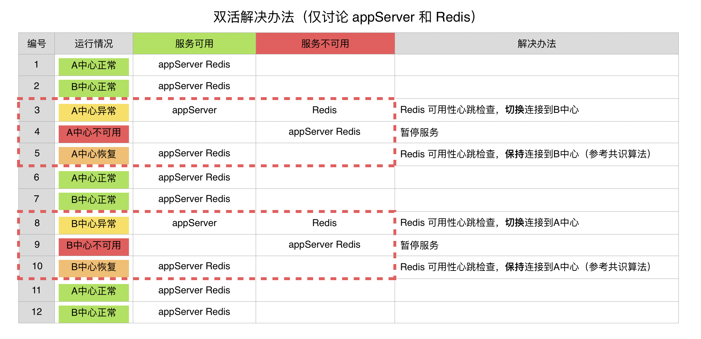

# 异地双中心高可用方案

## 业务背景



__可以看到：__

* 两个中心都有 appServer 和 Redis 服务器
* appServer 和 Redis 都有可能故障
* Redis 为了保证一致性，异地不进行主从同步，也不进行双写
* 每个中心内部 Redis 冗余

__解决方案：__

配置文件切换

__难点：__

共识算法实现

## 共识算法

共识算法理论参考：[拜占庭将军问题](https://zh.wikipedia.org/wiki/%E6%8B%9C%E5%8D%A0%E5%BA%AD%E5%B0%86%E5%86%9B%E9%97%AE%E9%A2%98)

实现思路：


枚举正常/异常情况：


## 代码实现

源代码：

[redis-keepalive.sh](redis-keepalive.sh)

使用方法：

- 命令：./redis-keepalive.sh [int]
- 加入定时任务，建议每5分钟检查一次

```shell
*/2 * * * * sh /data/switchredis/redis-keepalive.sh 2 >> /data/switchredis/redis-keepalive.log 2>&1
```
